```{r setup, include=FALSE}
knitr::opts_chunk$set(echo = FALSE, message=FALSE,warning = FALSE,
                      out.extra = "",fig.align = "left")
library(here)
library(ggplot2)
library(cowplot)
library(tidyverse)
library(data.table)
library(knitr)
library(bayesplot)
library(stringi)
theme_set(new = theme_classic())
```

## The Boussard *et al* data set

In here I present the statistical model used to estimate reinforcement learning 
parameters from data from a reversal learning task. In the experimental set up,
individuals from two experimental treatments are trained to pick one of two stimuli. 
Where one of those two options provides reward in the form of food pellets. 
The experiments is composed of 11 reversal blocks, each of these blocks is composed
of 30 trial. In other words, every 30 trials the stimulus that provides reward 
is switched. Thus, individuals must reverse their estimate of reward in order to make 
adaptive decisions and choose the rewarding stimulus. In figure \ref{fig:plotBoussard}, 
I show the proportion of correct choices for both treatment groups along the trials,
and reversal blocks. 


```{r plotBoussard,fig.show='hold',fig.cap='The Boussard *et al* data-set. Points show the proportion of successes achieved by individuals of both treatment groups along trials and reversal blocks.'}

source(here("plotBoussard.R"))
# png("boussard_data.png")
boussard_data %>% mutate(brainsize=as.factor(brainsize)) %>% 
  ggplot(aes(y=success,x=trial,col=brainsize))+
    stat_summary(fun = mean,geom = "point")+
    stat_summary(fun = mean,geom = "line")+
    # geom_point()+
    facet_grid(brainsize~reversal)+
    theme(legend.position = c(0.8,0.5),
          legend.direction = "horizontal",
          strip.text.y = element_blank())+
    scale_x_continuous(breaks=c(1,15,30))+
    guides(fill=guide_legend(title="Brain size"))+
    
    ggtitle("Repeated reversal vs brainsize")
# dev.off()
# 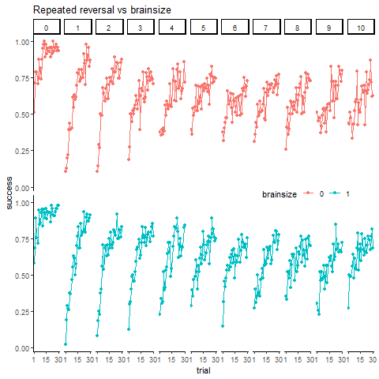
```

In order to evaluate the performance of the model in estimating the parameter values.
I first fit the model parameters to a data-set obtained by simulation the model
with a set of pre-set parameter values. I then evaluate whether the algorithm 
correctly estimates these parameters. The model is based of the Rescorla-Wagner
model of associative learning. Each individual has an estimate of reward for 
each stimulus. When two stimuli are presented together, the individual 
chooses one of the two with a probability given by the soft-max distribution. 
We assume all individuals use the same temperature parameter $(\tau)$. This 
parameter is estimated. Once the individual chooses one of the two stimuli, it
updates its estimates of reward associated with the chosen stimulus. 
The update is performed every trial and is given by the product of 
the *prediction error* $(\delta)$ and the *speed of learning* $(\alpha)$. 
The *prediction error* is calculated as the difference between the 
reward triggered by choosing a particular stimulus and the 
estimation of that reward prior to the
choice. We assume each individual expresses a different *speed of learning*, and 
it's given by fixed and random effects. The treatment group of each individual
is the fixed effect. Thus, we estimate a contribution of the treatment group to 
the *speed of learning* of each individual. As for the random effect, we assume 
the individual specific contributions to the speed of learning are distributed 
as a random variable with a normal distribution. We estimate the mean and 
standard deviation of the distribution. The model uses thus a hierarchical 
bayesian approach to estimating the parameters of the Rescorla-Wagner model. 

## The simple fake data set 

We first use the model to estimate a simple associative learning task without
any reward reversal. In table \ref{tab:param_simple}, I show the values of the
model parameters to simulate the first data-set. In figure \ref{fig:simple_dataset},
I show the average frequency of success for the two treatment groups. 
In figure \ref{fig:est_simple}, I show the confidence interval of the parameters 
estimated, as well as the values used for the simulations. 
In fig \ref{fig:ppcheck_simple}, I show how the data predicted by the estimated 
parameters compares with the data simulated from the 'real' parameters. 


```{r param_simple, results='asis'}
# Set parameters for the simulated data

pars.gen<-list(tau=1,mu_alpha=0.2,
               alphasT=c(-5,5),sigma_a=2)

pars.gen.table<-data.frame(parameters=c('Temperature','Mean speed of learning',
                    'Effect of treatment 0','Effect of treatment 1',
                    'St. dev. of speed of learning'),
                    values=as.matrix(unlist(pars.gen,use.names = FALSE)))


# set number of individuals
Nind <- 100

# get number of treatment groups
Ntreat <- 2

# get total number of trials (including all reversals)
Ntrials <- 100


kable(pars.gen.table,caption = '\\label{tab:param_simple} Parameters of the simulated data-set.')

```

  
```{r,include=FALSE,results='hide',eval=FALSE}

pars.gen$alphasID<-rnorm(Nind,mean = pars.gen$mu_alpha,sd = pars.gen$sigma_a)


# set the treatment for all individuals
treat_Inds <- rep(x=c(0,1),each=Nind/2)

# set the reversal structure 
block_r <- cbind(rep(0,Ntrials),rep(1,Ntrials))

# Simulate learning for all individuals

prediction.ind <- data.frame(
  val.1 = rep(0,dim(block_r)[1]),
  val.2 = rep(0,dim(block_r)[1]),
  choice = rep(0,dim(block_r)[1]),
  rew.1 = block_r[,1],
  rew.2 = block_r[,2],
  success = rep(0,dim(block_r)[1])
)


library(cmdstanr)
# Set cmdstan path 
## Erase to run in cluster
stan_path <- here("..","cmdstan","cmdstan-2.32.2")
set_cmdstan_path(stan_path)

# Compile stan model
boussard_RW_cmd<-cmdstan_model("boussard_RW.stan")

zeros<-matrix(data=rep(0,Nind*Ntrials),nrow = Nind,ncol = Ntrials)

# Simulate data using stan
invisible(
  sim_data_stan <- boussard_RW_cmd$sample(list(N=Nind,B=Ntreat,Tr=Ntrials,
                                             block_r=block_r,
                                             treat_ID=treat_Inds,
                                             y=zeros),
                                        fixed_param = TRUE,chains = 1,
                                        iter_sampling = 1,
                                        init=list(pars.gen))

)


predictions<-sim_data_stan$summary()

predictions <- predictions %>% filter(grepl("y_pred",variable)) %>% 
  select(c("variable","mean")) %>% 
  separate(variable,into=c("Individual","Trial"),sep = ",") %>% 
  mutate(Individual=parse_number(Individual),Trial=parse_number(Trial))

predictions <-rename(predictions,success=mean) %>%
  bind_cols(rep(treat_Inds,Ntrials)) %>% 
  rename(treatment=...4)

rm(list=c("sim_data_stan","zeros","prediction.ind"))

```
  
  
```{r simple_dataset,fig.cap='Simulated data from a simple associative learning model with two treatment effects. Points represent the frequency of successes among 50 individuals.'}

# png("simple_DS.png")
# predictions %>% mutate(treatment=as.factor(treatment)) %>%
#   ggplot(aes(y=success,x=Trial,col=treatment))+
#     stat_summary(fun = mean,geom = "point")+
#     stat_summary(fun = mean,geom = "line")+
#     facet_grid(~treatment)+
#     theme(legend.position = c(0.8,0.5),
#           legend.direction = "horizontal",
#           strip.text.y = element_blank())+
#     scale_x_continuous(breaks=c(1,100,200))+
#     guides(fill=guide_legend(title="Brain size"))+
#     ggtitle("Repeated reversal vs brainsize")
# dev.off()
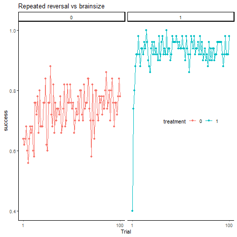

```
  
  
```{r,include=FALSE,results='hide',eval=FALSE}

pred_wide<-pivot_wider(predictions,names_from = Trial,
                       values_from = "success") %>%
  mutate(Individual=NULL,treatment=NULL)


# sample from posterior
fit_simulated_RW_cmd <- boussard_RW_cmd$sample(list(N=Nind,B=Ntreat,Tr=Ntrials,
                           block_r=block_r,
                           treat_ID=treat_Inds,
                           y=as.matrix(pred_wide)),
                           parallel_chains = getOption("mc.cores", 5),
                           chains = 5,iter_sampling = 1000)
# Save samples to file
fit_simulated_RW_cmd$save_object(file = "fit_sim_stan_trials.RDS")


fit_simulated_RW_cmd<-readRDS("fit_sim_stan_trials.RDS")

```


  
```{r est_simple,fig.cap=' Estimation of the paramerters used to generate the simulated data. Blue bars and lines correspond to the 50 and 90\\% credible intervals, respectively. Red points correspond to the real values of the parameteres used in the simulation.'}

# pars2plot <- c("tau", "mu_alpha", "alphasT[1]", "alphasT[2]",
#                 "sigma_a")
# pars2plot2 <- c("tau", "mu_alpha", "alphasT",
#                 "sigma_a")
# 
# posteriors<-fit_simulated_RW_cmd$draws(
#   variables = pars2plot)
# 
# realVals <- tibble(parameters=pars2plot,
#                    values=as.numeric(flatten(pars.gen[pars2plot2])))
# 
# # png("simple_mcmc_intervals.png")
# # mcmc_intervals(posteriors)  +
# #   geom_point(data=realVals,aes(x=values,y=parameters),colour='red',size=2)
# # dev.off()
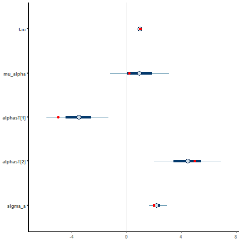
# rm(list=c("pars2plot2","pars2plot","realVals","posteriors"))

```
  
  
```{r ppcheck_simple,fig.cap='Out of sample posterior predictive checks of the bayesian estimation. Points correspond to a simulated data-set using the parameter values shown earlier. Light and dark grey bands correspond to the 50 and 90\\% credible interval of predictions made from the posterior distributions.'}


# preds <- fit_simulated_RW_cmd$draws(variables = "y_pred")
# 
# rm("fit_simulated_RW_cmd")
# 
# preds_df <- posterior::as_draws_df(preds)
# 
# 
# preds_long <- reshape2::melt(preds_df,id=c('.chain','.iteration'),
#                    measure.vars=grep("y_pred",colnames(preds_df)))
# 
# preds_long <- preds_long %>% filter(.chain<2)
# 
# preds_long <- as.data.table(preds_long)
# 
# preds_long[,c("individual","trial"):=tstrsplit(variable,",")]
# 
# preds_long[,`:=`(individual=parse_number(individual),
#                  trial=parse_number(trial))]
# preds_long[,variable:=NULL]
# 
# preds_long[,treatment:=as.factor(ifelse(individual<50,0,1))]
# 
# # Average over de MCMC samples
# mean_ind <- preds_long[,mean(value),by=.(.chain,.iteration,treatment,trial)]
# 
# png("simple_ppchecks.png")
# ggplot(mean_ind,aes(x=trial,y=V1,col=treatment))+
#   stat_summary(geom="ribbon",alpha = 0.2,fun.max = function(x){
#     quantile(x,0.95)},
#     fun.min = function(x){
#     quantile(x,0.05)},colour=NA)+
#   stat_summary(geom="ribbon",alpha = 0.5,fun.max = function(x){
#     quantile(x,0.75)},
#     fun.min = function(x){
#     quantile(x,0.25)},colour=NA)+
#   stat_summary(data=predictions %>% mutate(treatment=as.factor(treatment)),
#                aes(y=success,x=Trial,col=treatment),
#                fun = mean,geom = "point")+
#   facet_grid(~treatment)
# dev.off()
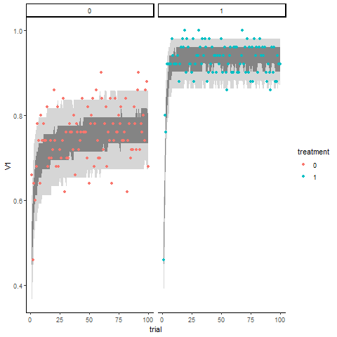
```

## The reversal fake data set 

Now I presented a date-set simulatd from the model, but including reversal 
learning structured in the same way as the Boussard *et al* experiments. 
Table \ref{tab:param_rev} shows the parameter values used for the simulations, 
fig. \ref{fig:rev_sim_data} shows the data simulated from the model, 
fig. \ref{fig:rev_sim_interv} shows the estimation of the parameters together 
with the'real' value. Finally, fig. \ref{fig:ppcheck_rev} shows the predictions 
from the estimated parameters together with data simulated with the 'real' values.

```{r param_rev, results='asis'}
# Set parameters for the simulated data
pars.gen<-list(tau=1,mu_alpha=0.2,
               alphasT=c(-2,2),sigma_a=2)

pars.gen.table<-data.frame(parameters=c('Temperature','Mean speed of learning',
                    'Effect of treatment 0','Effect of treatment 1',
                    'St. dev. of speed of learning'),
                    values=c(1,0.2,-2,2,0.5))

# set number of individuals
Nind <- 96

# set number of treatment groups
Ntreat <- 2

# set number of trials per reversal
NtriRev <- 30

Nrev <-11

# get total number of trials (including all reversals)
Ntrials <- NtriRev*Nrev

kable(pars.gen.table,caption = '\\label{tab:param_rev} Parameters of the simulated reversal learning 
      data-set ')
```


```{r rev_dataset,include=FALSE,results='hide',eval=FALSE}

pars.gen$alphasID<-rnorm(Nind,mean = pars.gen$mu_alpha,sd = pars.gen$sigma_a)

# set the treatment for all individuals
treat_Inds <- rep(x=c(0,1),each=Nind/2)

# set the reversal structure 
block_r <-cbind(c(rep(c(0,1),each=NtriRev,
                      times=6)[1:Ntrials]),
                c(rep(c(1,0),each=NtriRev,
                      times=6)[1:Ntrials]))

# Simulate learning for all individuals
prediction.ind <- data.frame(
  val.1 = rep(0,dim(block_r)[1]),
  val.2 = rep(0,dim(block_r)[1]),
  choice = rep(0,dim(block_r)[1]),
  rew.1 = block_r[,1],
  rew.2 = block_r[,2],
  success = rep(0,dim(block_r)[1])
)


zeros<-matrix(data=rep(0,Nind*Ntrials),nrow = Nind,ncol = Ntrials)

# Simulate data using stan
invisible(
  sim_data_stan <- boussard_RW_cmd$sample(list(N=Nind,B=Ntreat,Tr=Ntrials,
                                             block_r=block_r,
                                             treat_ID=treat_Inds,
                                             y=zeros),
                                        fixed_param = TRUE,chains = 1,
                                        iter_sampling = 1,
                                        init=list(pars.gen))

)


predictions<-sim_data_stan$summary()

predictions <- predictions %>% filter(grepl("y_pred",variable)) %>% 
  select(c("variable","mean")) %>% 
  separate(variable,into=c("Individual","Trial"),sep = ",") %>% 
  mutate(Individual=parse_number(Individual),Trial=parse_number(Trial))

predictions <-rename(predictions,success=mean) %>%
  bind_cols(rep(treat_Inds,Ntrials)) %>% 
  rename(treatment=...4) %>% 
  mutate(reversal= as.integer((Trial-1)/NtriRev)) %>% 
  mutate(RTrial=(Trial-1) %% NtriRev)

rm(list=c("sim_data_stan","zeros","prediction.ind"))

```


```{r rev_sim_data,fig.cap='Simulated data of the reversal learning model.'}
# png("reversal_data.png")
# predictions %>% mutate(treatment=as.factor(treatment)) %>%
#   ggplot(aes(y=success,x=RTrial,col=treatment))+
#     stat_summary(fun = mean,geom = "point")+
#     stat_summary(fun = mean,geom = "line")+
#     facet_grid(treatment~reversal)+
#     theme(legend.position = c(0.8,0.6),
#           legend.direction = "horizontal",
#           strip.text.y = element_blank())+
#     # scale_x_continuous(breaks=c(1,100,200))+
#     guides(fill=guide_legend(title="Brain size"))+
#     ggtitle("Repeated reversal vs brainsize")
# dev.off()
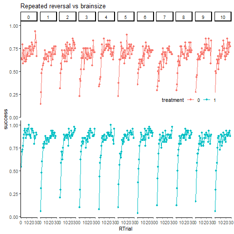
```


```{r,include=FALSE,results='hide',eval=FALSE}
pred_wide<-pivot_wider(predictions,names_from = Trial,
                       values_from = "success",
                       id_cols = c(Individual)) %>%
  mutate(Individual=NULL,treatment=NULL)


# sample from posterior
fit_simulated_RW_cmd <- boussard_RW_cmd$sample(list(N=Nind,B=Ntreat,Tr=Ntrials,
                           block_r=block_r,
                           treat_ID=treat_Inds,
                           y=as.matrix(pred_wide)),
                           parallel_chains = getOption("mc.cores", 5),
                           chains = 3,iter_sampling = 1000)
# Save samples to file
fit_simulated_RW_cmd$save_object(file = "fit_reversal_fake.RDS")


# fit_simulated_RW_cmd<-readRDS("fit_reversal_fake.RDS")

```


```{r rev_sim_interv,fig.cap='Estimated credible intervals and real values of the parameters of the reversal learning model. Blue bars and lines correspond to the 50 and 90\\% credible intervals, respectively. Red points correspond to the real values of the parameteres used in the simulation of reversal learning. '}
# pars2plot <- c("tau", "mu_alpha", "alphasT[1]", "alphasT[2]",
#                 "sigma_a")
# pars2plot2 <- c("tau", "mu_alpha", "alphasT",
#                 "sigma_a")
# 
# posteriors<-fit_simulated_RW_cmd$draws(
#   variables = pars2plot)
# 
# realVals <- tibble(parameters=pars2plot,
#                    values=as.numeric(flatten(pars.gen[pars2plot2])))
# png("reversal_mcmc_interv.png")
# mcmc_intervals(posteriors)  +
#   geom_point(data=realVals,aes(x=values,y=parameters),colour='red',size=2)
# dev.off()
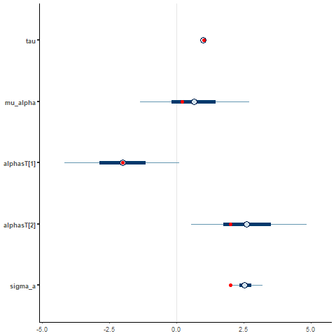
# rm(list=c("pars2plot2","pars2plot","posteriors"))
  
```


```{r ppcheck_rev,fig.cap='Out of sample posterior predictive checks of the bayesian estimation. Points correspond to a simulated data-set using the parameter values shown earlier from the simulation of reversal learning. Light and dark grey bands correspond to the 50 and 90\\% credible interval'}

# preds <- fit_simulated_RW_cmd$draws(variables = "y_pred")
# 
# rm("fit_simulated_RW_cmd")
# 
# preds_df <- posterior::as_draws_df(preds)
# 
# preds_long <- reshape2::melt(preds_df,id=c('.chain','.iteration'),
#                    measure.vars=grep("y_pred",colnames(preds_df)))
# 
# rm(list=c("preds","preds_df"))
# preds_long <- preds_long %>% filter(.chain<2)
# # preds_long <- as.data.table(preds_long)
# 
# preds_long <- as.data.table(preds_long)
# 
# preds_long[,c("individual","trial"):=tstrsplit(variable,",")]
# 
# # preds_long <- preds_long %>%
# #   separate_wider_delim(cols = variable,delim=",",
# #                        names=c("individual","trial"))
# 
# preds_long[,variable:=NULL]
# 
# preds_long[,`:=`(individual=parse_number(individual),
#                  trial=parse_number(trial))]
# 
# preds_long[,treatment:=as.factor(ifelse(individual<48,0,1))]
# 
# # Average over de MCMC samples
# mean_ind <- preds_long[,mean(value),by=.(.chain,.iteration,treatment,trial)]
# 
# rm(list="preds_long")
# 
# ggplot(mean_ind,aes(x=trial,y=V1,col=treatment))+
#   stat_summary(geom="ribbon",alpha = 0.2,fun.max = function(x){
#     quantile(x,0.95)},
#     fun.min = function(x){
#     quantile(x,0.05)},colour=NA)+
#   stat_summary(geom="ribbon",alpha = 0.5,fun.max = function(x){
#     quantile(x,0.75)},
#     fun.min = function(x){
#     quantile(x,0.25)},colour=NA)+
#   stat_summary(data=predictions %>% mutate(treatment=as.factor(treatment)),
#                aes(y=success,x=Trial,col=treatment),
#                fun = mean,geom = "point")+
#   facet_grid(~treatment)
# dev.off()
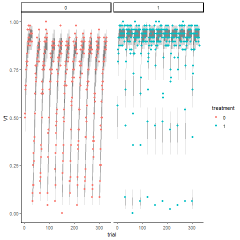
```

## Fitting the model to the Boussard *et al* data set

Now we use the model to fit the parameters to the Boussard *et al* data-set. 
Figure \ref{fig:boussard_interv} shows the parameters estimated and 
figure \ref{fig:ppchecks_boussard} shows how well the data fits the predictions 
from the model. Clearly a model with constant speed of learning throughout the 
reversal blocks does not capture well the desicion-making dynamics.


```{r,include=FALSE,results='hide',eval=FALSE}

source(here("plotBoussard.R"))

boussard_data <-boussard_data %>% as.data.table()

# boussard_data <-boussard_data[tankID<5 &
#                                 reversal<2]

# get number of individuals
Nind <- boussard_data[,tankID] %>% unique() %>% length()

# get number of treatment groups
Ntreat <- boussard_data[,brainsize] %>% unique() %>% length()

# get total number of trials (including all reversals)
Ntrials <- boussard_data[,interaction(trial,reversal)] %>%
              unique() %>% length()

Nrev <- boussard_data[,reversal] %>%
              unique() %>% length()

setorder(boussard_data,tankID,reversal,trial)

# get the treatment for all individuals
treat_Inds <- boussard_data[,unique(brainsize),by=tankID][,V1]

# set the reversal structure
block_r <-cbind(c(rep(c(0,1),each=30,
                      times=6)[1:dim(boussard_data[tankID==1])[1]]),
                c(rep(c(1,0),each=30,
                      times=6)[1:dim(boussard_data[tankID==1])[1]]))


# Get a unique ID for trials along the reversal blocks
boussard_data[,trial.long:=interaction(reversal,trial)]

# Set NA as failure to choose the rewarding option
boussard_data[is.na(success),success:=0]

# Transform the success variable, to fit stan model
boussard_wide<-dcast(boussard_data[,.(trial.long,tankID,success)],
                     trial.long~tankID,value.var = "success")

boussard_wide[,trial.long:=NULL]

boussard_wide<-t(boussard_wide)


# using cmdstanr

library(cmdstanr)
# Set cmdstan path
## Erase to run in cluster
stan_path <- here("..","cmdstan","cmdstan-2.32.2")
set_cmdstan_path(stan_path)

# Compile stan model with different random alpha for each reversal
boussard_RW_rev<-cmdstan_model("boussard_RW_rev.stan")


# sample from posterior
fit_boussard_RW_rev <- boussard_RW_rev$sample(list(N=Nind,B=Ntreat,Tr=Ntrials/Nrev,
                                 Rev=Nrev,TotTr=Ntrials,
                                 block_r=block_r,
                                 treat_ID=treat_Inds,
                                 y=boussard_wide),
                                 parallel_chains = getOption("mc.cores", 5),
                                 chains = 3)

# Save samples to file
fit_boussard_RW_cmd$save_object(file = "fit_boussard_stan.RDS")

fit_boussard_RW_cmd<-readRDS("fit_boussard_stan.RDS")

```


```{r boussard_interv,fig.cap='Bayesian estimation of paramteres to the Boussard *et al* 2020 data-set. Light and dark grey bands correspond to the 50 and 90\\% credible interval'}
# pars2plot <- c("tau", "mu_alpha", "alphasT[1]", "alphasT[2]",
#                 "sigma_a")
# 
# posteriors<-fit_boussard_RW_cmd$draws(
#   variables = pars2plot)
# 
# png("boussard_mcmc_interv.png")
# mcmc_intervals(posteriors)
# dev.off()
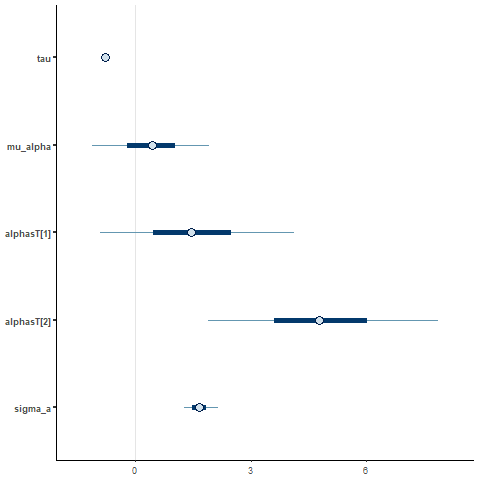
# rm(list=c("pars2plot","posteriors"))

```


```{r ppchecks_boussard,fig.cap='Posterior predictive checks of the bayesian estimation. Points correspond to Boussard *et al* 2020 data-set . Light and dark grey bands correspond to the 50 and 90\\% credible interval predicted by the model'}
# preds <- fit_boussard_RW_cmd$draws(variables = "y_pred")
# 
# preds_df <- posterior::as_draws_df(preds)
# 
# preds_long <- reshape2::melt(preds_df,id=c('.chain','.iteration'),
#                    measure.vars=grep("y_pred",colnames(preds_df)))
# 
# rm(list=c("preds","preds_df"))
# 
# preds_long <- preds_long %>% filter(.chain<2)
# # preds_long <- as.data.table(preds_long)
# 
# preds_long <- as.data.table(preds_long)
# 
# preds_long[,c("individual","trial"):=tstrsplit(variable,",")]
# 
# preds_long[,variable:=NULL]
# 
# preds_long[,`:=`(individual=parse_number(individual),
#                  trial=parse_number(trial))]
# 
# preds_long[,treatment:=as.factor(ifelse(individual<50,0,1))]
# 
# 
# # Average over de MCMC samples
# mean_ind <- preds_long[,mean(value),by=.(.chain,.iteration,treatment,trial)]
# 
# rm(list="preds_long")
# 
# 
# mean_ind <-mean_ind %>%
#   mutate(reversal= as.integer((trial-1)/30)) %>%
#   mutate(RTrial=((trial-1) %% 30)+1)
# 
# colnames(mean_ind) <- c("chain","iteration","brainsize","Ttrial","success",
#                         "reversal","trial")
# 
# 
# png("boussard_ppchecks.png")
# boussard_data %>% mutate(brainsize=as.factor(brainsize)) %>%
#   ggplot(aes(y=success,x=trial,col=brainsize))+
#     stat_summary(fun = mean,geom = "point")+
#     stat_summary(fun = mean,geom = "line")+
#     # geom_point()+
#     theme(legend.position = c(0.8,0.5),
#           legend.direction = "horizontal",
#           strip.text.y = element_blank())+
#     scale_x_continuous(breaks=c(1,15,30))+
#     guides(fill=guide_legend(title="Brain size"))+
#     ggtitle("Repeated reversal vs brainsize")+
#     facet_grid(brainsize~reversal)+
#     stat_summary(data=mean_ind,aes(x=trial,y=success,col=as.factor(brainsize)),
#                  geom="ribbon",alpha = 0.2,fun.max = function(x){
#       quantile(x,0.95)},
#       fun.min = function(x){
#       quantile(x,0.05)},colour=NA)+
#     stat_summary(data=mean_ind,aes(x=trial,y=success,col=as.factor(brainsize)),
#                  geom="ribbon",alpha = 0.5,fun.max = function(x){
#       quantile(x,0.75)},
#       fun.min = function(x){
#       quantile(x,0.25)},colour=NA)+
#     facet_grid(brainsize~reversal)
# dev.off()
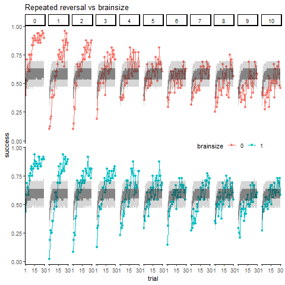

```

## Let' fit a model with different learning rates in reversal blocks to the Boussard [-@boussard_Brain_2020] data set 

Now we use a model where we allow individuals to have a different 
*speed of learning* on each reversal block. To do that, we estimate a fixed effect
of the reversal block on the parameter $\alpha$. Figure \ref{fig:interv_rev} shows 
the estimated parameters including the effect of reversal block on 
the *speed of learning*, figure \ref{fig:ppchecks_boussard_rev} shows how well the model
predicts the data. For some reason, the model estimates a very low 
*speed of learning* in the early blocks of reversal. This causes the model to 
perform rather poorly in explaining the desicion-making dynamics. 

```{r,include=FALSE,results='hide',eval=FALSE}

source(here("plotBoussard.R"))

boussard_data <-boussard_data %>% as.data.table()

# boussard_data <-boussard_data[tankID<5 &
#                                 reversal<2]

# get number of individuals
Nind <- boussard_data[,tankID] %>% unique() %>% length()

# get number of treatment groups
Ntreat <- boussard_data[,brainsize] %>% unique() %>% length()

# get total number of trials (including all reversals)
Ntrials <- boussard_data[,interaction(trial,reversal)] %>%
              unique() %>% length()

Nrev <- boussard_data[,reversal] %>%
              unique() %>% length()

NtriRev <- Ntrials/Nrev

setorder(boussard_data,tankID,reversal,trial)

# get the treatment for all individuals
treat_Inds <- boussard_data[,unique(brainsize),by=tankID][,V1]

# set the reversal structure
block_r <-cbind(c(rep(c(0,1),each=30,
                      times=6)[1:dim(boussard_data[tankID==1])[1]]),
                c(rep(c(1,0),each=30,
                      times=6)[1:dim(boussard_data[tankID==1])[1]]))


# Get a unique ID for trials along the reversal blocks
boussard_data[,trial.long:=interaction(reversal,trial)]

# Set NA as failure to choose the rewarding option
boussard_data[is.na(success),success:=0]

# Transform the success variable, to fit stan model
boussard_wide<-dcast(boussard_data[,.(trial.long,tankID,success)],
                     trial.long~tankID,value.var = "success")

boussard_wide[,trial.long:=NULL]

boussard_wide<-t(boussard_wide)


# using cmdstanr

library(cmdstanr)
# Set cmdstan path
## Erase to run in cluster
stan_path <- here("..","cmdstan","cmdstan-2.32.2")
set_cmdstan_path(stan_path)

# Compile stan model with random alpha
boussard_RW_rev<-cmdstan_model("boussard_RW_rev.stan")


# sample from posterior
fit_boussard_RW_rev <- boussard_RW_rev$sample(list(N=Nind,B=Ntreat,Tr=NtriRev,
                                         Rev=Nrev,TotTr=Ntrials,
                                         block_r=block_r,treat_ID=treat_Inds,
                                         y=boussard_wide),
                                 parallel_chains = getOption("mc.cores", 5),
                                 chains = 5)

# Save samples to file
fit_boussard_RW_rev$save_object(file = "fit_boussard_rev.RDS")

fit_boussard_RW_rev<-readRDS("fit_boussard_rev.RDS")

```


```{r interv_rev,fig.cap='Estimated credible intervals of the parameters of the reversal learning model. Blue bars and lines correspond to the 50 and 90\\% credible intervals, respectively. Red points correspond to the real values of the parameteres used in the simulation of reversal learning. Panel on the right shows the estimated effect of the reversal blocks on the speed of learning.'}
# pars2plot <- c("tau", "mu_alpha", "alphasT[1]", "alphasT[2]",
#                 "sigma_a")
# 
# posteriors<-fit_boussard_RW_rev$draws(
#   variables = pars2plot)
# 
# posteriorsRev <- fit_boussard_RW_rev$draws(variables = "alphasRev")
# 
# png("boussard_mcmc_interv_rev.png")
# cowplot::plot_grid(mcmc_intervals(posteriors),
#                    mcmc_intervals(posteriorsRev))
# dev.off()
# rm(list=c("pars2plot","posteriors"))
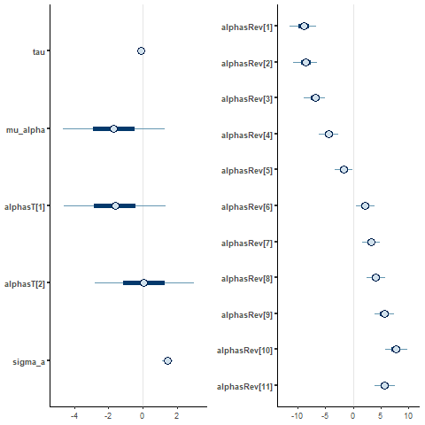


```


```{r ppchecks_boussard_rev, fig.cap='Posterior predictive checks of the bayesian estimation for a model with different *speed of learning* on the reversal blocks. Points correspond to Boussard  data-set. Light and dark grey bands correspond to the 50 and 90\\% credible interval predicted by the model'}

# preds <- fit_boussard_RW_rev$draws(variables = "y_pred")
# 
# rm(list="fit_boussard_RW_rev")
# 
# preds_df <- posterior::as_draws_df(preds)
# 
# preds_long <- reshape2::melt(preds_df,id=c('.chain','.iteration'),
#                    measure.vars=grep("y_pred",colnames(preds_df)))
# 
# 
# rm(list=c("preds","preds_df"))
# 
# preds_long <- as.data.table(preds_long)
# 
# preds_long <- preds_long[.chain<3,]
# 
# preds_long[,c("individual","trial"):=tstrsplit(variable,",")]
# # preds_long[,c("individual","trial"):=stri_split_fixed(variable,",")]
# 
# preds_long[,variable:=NULL]
# 
# preds_long[,`:=`(trial=parse_number(trial),
#                  individual=parse_number(individual))]
# 
# 
# preds_long[,treatment:=as.factor(ifelse(individual<50,0,1))]
# 
# # Average over de MCMC samples
# mean_ind <- preds_long[,mean(value),by=.(.chain,.iteration,treatment,trial)]
# 
# rm(list="preds_long")
# 
# 
# mean_ind <-mean_ind %>%
#   mutate(reversal= as.integer((trial-1)/30)) %>%
#   mutate(RTrial=((trial-1) %% 30)+1)
# 
# colnames(mean_ind) <- c("chain","iteration","brainsize","Ttrial","success",
#                         "reversal","trial")
# 
# 
# png("boussardRev_ppchecks.png")
# boussard_data %>% mutate(brainsize=as.factor(brainsize)) %>%
#   ggplot(aes(y=success,x=trial,col=brainsize))+
#     stat_summary(fun = mean,geom = "point")+
#     stat_summary(fun = mean,geom = "line")+
#     # geom_point()+
#     theme(legend.position = c(0.8,0.5),
#           legend.direction = "horizontal",
#           strip.text.y = element_blank())+
#     scale_x_continuous(breaks=c(1,15,30))+
#     guides(fill=guide_legend(title="Brain size"))+
#     ggtitle("Repeated reversal vs brainsize")+
#     stat_summary(data=mean_ind,aes(x=trial,y=success,col=as.factor(brainsize)),
#                  geom="ribbon",alpha = 0.2,fun.max=function(x){
#       quantile(x,0.95)},
#       fun.min = function(x){
#       quantile(x,0.05)},colour=NA)+
#     stat_summary(data=mean_ind,aes(x=trial,y=success,col=as.factor(brainsize)),
#                  geom="ribbon",alpha = 0.5,fun.max = function(x){
#       quantile(x,0.75)},
#       fun.min = function(x){
#       quantile(x,0.25)},colour=NA)+
#     facet_grid(brainsize~reversal)
# dev.off()
include_graphics("images/boussardREV_ppchecks.png")

```

## The reversal fake data set with different learning rates in the different reversal blocks
 
```{r param_rev_sim, results='asis'}
# Set parameters for the simulated data
pars.gen<-list(tau=1,mu_alpha=0,
               alphasT=c(-2,0.5),sigma_a=2,
               alphasRev=c(seq(2,-2,length=11)))


pars.gen.table<-data.frame(parameters=c('Temperature','Mean speed of learning',
                    'Effect of treatment 0','Effect of treatment 1',
                    'St. dev. of speed of learning',paste0('Effect of reversal block ',1:11)),
                    values=as.matrix(unlist(pars.gen,use.names = FALSE)))

# set number of individuals
Nind <- 96

# set number of treatment groups
Ntreat <- 2

# set number of trials per reversal
NtriRev <- 30

Nrev <-11

# get total number of trials (including all reversals)
Ntrials <- NtriRev*Nrev

kable(pars.gen.table,caption = '\\label{tab:param_rev_meta} Parameters of the simulated reversal learning 
      data-set ')
```


```{r rev_sim_block,include=FALSE,results='hide',eval=FALSE}

pars.gen$alphasID<-rnorm(Nind,pars.gen$mu_alpha,sd = pars.gen$sigma_a)


# set the treatment for all individuals
treat_Inds <- rep(x=c(0,1),each=Nind/2)

# set the reversal structure 
block_r <-cbind(c(rep(c(0,1),each=NtriRev,
                      times=6)[1:Ntrials]),
                c(rep(c(1,0),each=NtriRev,
                      times=6)[1:Ntrials]))

# Simulate learning for all individuals
prediction.ind <- data.frame(
  val.1 = rep(0,dim(block_r)[1]),
  val.2 = rep(0,dim(block_r)[1]),
  choice = rep(0,dim(block_r)[1]),
  rew.1 = block_r[,1],
  rew.2 = block_r[,2],
  success = rep(0,dim(block_r)[1])
)

zeros<-matrix(data=rep(0,Nind*Ntrials),nrow = Nind,ncol = Ntrials)

library(cmdstanr)
# Set cmdstan path 
## Erase to run in cluster
stan_path <- here("..","cmdstan","cmdstan-2.32.2")
set_cmdstan_path(stan_path)

# Compile stan model
boussard_RW_rev<-cmdstan_model("boussard_RW_rev.stan")

zeros<-matrix(data=rep(0,Nind*Ntrials),nrow = Nind,ncol = Ntrials)

# Simulate data using stan
invisible(
  sim_data_stan <- boussard_RW_rev$sample(list(N=Nind,B=Ntreat,Tr=Ntrials/Nrev,
                                             Rev=Nrev,TotTr=Ntrials,
                                             block_r=block_r,
                                             treat_ID=treat_Inds,
                                             y=zeros),
                                        fixed_param = TRUE,chains = 1,
                                        iter_sampling = 1,
                                        init=list(pars.gen))

)


predictions<-sim_data_stan$summary()

predictions <- predictions %>% filter(grepl("y_pred",variable)) %>% 
  select(c("variable","mean")) %>% 
  separate(variable,into=c("Individual","Trial"),sep = ",") %>% 
  mutate(Individual=parse_number(Individual),Trial=parse_number(Trial))

predictions <-rename(predictions,success=mean) %>%
  bind_cols(rep(treat_Inds,Ntrials)) %>% 
  rename(treatment=...4) %>% 
  mutate(reversal= as.integer((Trial-1)/NtriRev)) %>% 
  mutate(RTrial=(Trial-1) %% NtriRev)

rm(list=c("sim_data_stan","zeros","prediction.ind"))

```


```{r rev_sim_data_block,fig.cap='Simulated data of the reversal learning model.'}
# png("reversal_data_sim_block.png")
# predictions %>% mutate(treatment=as.factor(treatment)) %>%
#   ggplot(aes(y=success,x=RTrial,col=treatment))+
#     stat_summary(fun = mean,geom = "point")+
#     stat_summary(fun = mean,geom = "line")+
#     facet_grid(treatment~reversal)+
#     ylim(-0.1,1.1)+
#     theme(legend.position = c(0.8,0.5),
#           legend.direction = "horizontal",
#           strip.text.y = element_blank())+
#     # scale_x_continuous(breaks=c(1,100,200))+
#     guides(fill=guide_legend(title="Brain size"))+
#     ggtitle("Repeated reversal vs brainsize")
# dev.off()
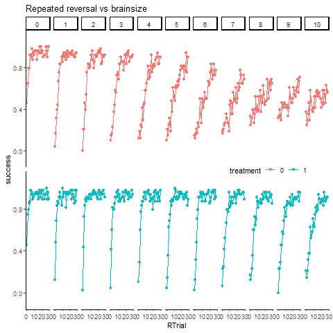
```

```{r,include=FALSE,results='hide',eval=FALSE}

# pred_wide<-pivot_wider(predictions,names_from = Trial,
#                        values_from = "success",
#                        id_cols = c(Individual)) %>%
#   mutate(Individual=NULL,treatment=NULL)
#   
# 
# 
# # sample from posterior
# fit_simulated_RW_rev <- boussard_RW_rev$sample(list(N=Nind,B=Ntreat,Tr=Ntrials/Nrev,
#                                              Rev=Nrev,TotTr=Ntrials,
#                                              block_r=block_r,
#                                              treat_ID=treat_Inds,
#                            y=as.matrix(pred_wide)),
#                            parallel_chains = getOption("mc.cores", 5),
#                            chains = 5,iter_sampling = 1000)
# # Save samples to file
# fit_simulated_RW_rev$save_object(file = "fit_reversal_block_fake.RDS")


fit_simulated_RW_rev<-readRDS("fit_reversal_block_fake.RDS")

```


```{r rev_sim_interv_block,fig.cap='Estimated credible intervals and real values of the parameters of the reversal learning model. Blue bars and lines correspond to the 50 and 90\\% credible intervals, respectively. Red points correspond to the real values of the parameteres used in the simulation of reversal learning. '}

# pars2plot <- c("tau", "mu_alpha", "alphasT[1]", "alphasT[2]",
#                 "sigma_a")
# 
# pars2plot2 <- c("tau", "mu_alpha", "alphasT",
#                 "sigma_a")
# 
# posteriors<-fit_simulated_RW_rev$draws(
#   variables = pars2plot)
# 
# posteriorsRev <- fit_simulated_RW_rev$draws(variables = "alphasRev")
# 
# realVals <- tibble(parameters=pars2plot,
#                    values=as.numeric(flatten(pars.gen[pars2plot2])))
# 
# realValsRev <- tibble(parameters=paste0("alphasRev[",1:11,"]"),
#                    values=as.numeric(flatten(pars.gen["alphasRev"])))
# 
# png("sim_mcmc_interv_rev.png")
# cowplot::plot_grid(mcmc_intervals(posteriors)+
#                      geom_point(data=realVals,aes(x=values,y=parameters),
#                                 colour='red',size=2),
#                    mcmc_intervals(posteriorsRev)+
#                      geom_point(data=realValsRev,aes(x=values,y=parameters),
#                                 colour='red',size=2))
# dev.off()
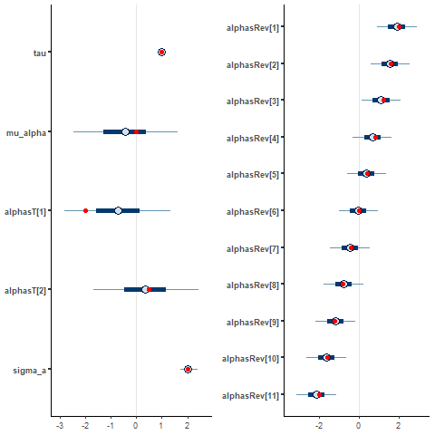
# rm(list=c("pars2plot2","pars2plot","posteriors"))
  
```


```{r ppcheck_rev_sim,fig.cap='Out of sample posterior predictive checks of the bayesian estimation. Points correspond to a simulated data-set using the parameter values shown earlier from the simulation of reversal learning. Light and dark grey bands correspond to the 50 and 90\\% credible interval'}

# preds <- fit_simulated_RW_rev$draws(variables = "y_pred")
# 
# rm("fit_simulated_RW_rev")
# 
# preds_df <- posterior::as_draws_df(preds)
# 
# preds_long <- reshape2::melt(preds_df,id=c('.chain','.iteration'),
#                    measure.vars=grep("y_pred",colnames(preds_df)))
# 
# rm(list=c("preds","preds_df"))
# preds_long <- preds_long %>% filter(.chain<2)
# # preds_long <- as.data.table(preds_long)
# 
# preds_long <- as.data.table(preds_long)
# 
# preds_long[,c("individual","trial"):=tstrsplit(variable,",")]
# 
#  
# preds_long[,variable:=NULL]
# 
# preds_long[,`:=`(individual=parse_number(individual),
#                  trial=parse_number(trial))]
# 
# preds_long[,treatment:=as.factor(ifelse(individual<48,0,1))]
# 
# # Average over de MCMC samples
# mean_ind <- preds_long[,mean(value),by=.(.chain,.iteration,treatment,trial)]
# 
# rm(list="preds_long")

# png("sim_reversal_ppchecks.png")
# ggplot(mean_ind,aes(x=trial,y=V1,col=treatment))+
#   stat_summary(geom="ribbon",alpha = 0.2,fun.max = function(x){
#     quantile(x,0.95)},
#     fun.min = function(x){
#     quantile(x,0.05)},colour=NA)+
#   stat_summary(geom="ribbon",alpha = 0.5,fun.max = function(x){
#     quantile(x,0.75)},
#     fun.min = function(x){
#     quantile(x,0.25)},colour=NA)+
#   stat_summary(data=predictions %>% mutate(treatment=as.factor(treatment)),
#                aes(y=success,x=Trial,col=treatment),
#                fun = mean,geom = "point")+
#   facet_grid(~treatment)
# dev.off()
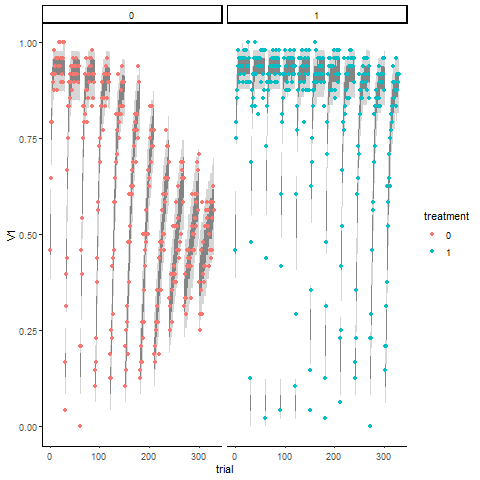
```


 
<!-- ## Fitting a model with random temperature parameter to the Boussard *et al* data set -->

<!-- ```{r,include=FALSE,results='hide'} -->

<!-- source(here("plotBoussard.R")) -->

<!-- boussard_data <-boussard_data %>% as.data.table() -->

<!-- # get number of individuals -->
<!-- Nind <- boussard_data[,tankID] %>% unique() %>% length() -->

<!-- # get number of treatment groups -->
<!-- Ntreat <- boussard_data[,brainsize] %>% unique() %>% length() -->

<!-- # get total number of trials (including all reversals) -->
<!-- Ntrials <- boussard_data[,interaction(trial,reversal)] %>% -->
<!--               unique() %>% length() -->

<!-- Nrev <- boussard_data[,reversal] %>% -->
<!--               unique() %>% length() -->

<!-- NtriRev <- Ntrials/Nrev -->

<!-- setorder(boussard_data,tankID,reversal,trial) -->

<!-- # get the treatment for all individuals -->
<!-- treat_Inds <- boussard_data[,unique(brainsize),by=tankID][,V1] -->

<!-- # set the reversal structure -->
<!-- block_r <-cbind(c(rep(c(0,1),each=30, -->
<!--                       times=6)[1:dim(boussard_data[tankID==1])[1]]), -->
<!--                 c(rep(c(1,0),each=30, -->
<!--                       times=6)[1:dim(boussard_data[tankID==1])[1]])) -->


<!-- # Get a unique ID for trials along the reversal blocks -->
<!-- boussard_data[,trial.long:=interaction(reversal,trial)] -->

<!-- # Set NA as failure to choose the rewarding option -->
<!-- boussard_data[is.na(success),success:=0] -->

<!-- # Transform the success variable, to fit stan model -->
<!-- boussard_wide<-dcast(boussard_data[,.(trial.long,tankID,success)], -->
<!--                      trial.long~tankID,value.var = "success") -->

<!-- boussard_wide[,trial.long:=NULL] -->

<!-- boussard_wide<-t(boussard_wide) -->


<!-- # using cmdstanr -->

<!-- library(cmdstanr) -->
<!-- # Set cmdstan path -->
<!-- ## Erase to run in cluster -->
<!-- stan_path <- here("..","cmdstan","cmdstan-2.32.2") -->
<!-- set_cmdstan_path(stan_path) -->

<!-- # Compile stan model with random alpha -->
<!-- boussard_RW_rev_tau<-cmdstan_model("boussard_RW_rev_tau.stan") -->


<!-- # sample from posterior -->
<!-- fit_boussard_RW_rev_tau <- boussard_RW_rev_tau$sample(list(N=Nind,B=Ntreat,Tr=NtriRev, -->
<!--                                          Rev=Nrev,TotTr=Ntrials, -->
<!--                                          block_r=block_r,treat_ID=treat_Inds, -->
<!--                                          y=boussard_wide), -->
<!--                                  parallel_chains = getOption("mc.cores", 5), -->
<!--                                  chains = 5) -->

<!-- # Save samples to file -->
<!-- fit_boussard_RW_rev$save_object(file = "fit_boussard_rev.RDS") -->

<!-- # fit_boussard_RW_rev<-readRDS("fit_boussard_rev.RDS") -->

<!-- ``` -->


<!-- ```{r} -->
<!-- # pars2plot <- c("tau", "mu_alpha", "alphasT[1]", "alphasT[2]", -->
<!-- #                 "sigma_a") -->
<!-- #  -->
<!-- # posteriors<-fit_boussard_RW_rev$draws( -->
<!-- #   variables = pars2plot) -->
<!-- #  -->
<!-- # posteriorsRev <- fit_boussard_RW_rev$draws(variables = "alphasRev") -->
<!-- #  -->
<!-- # png("boussard_mcmc_interv_rev.png") -->
<!-- # cowplot::plot_grid(mcmc_intervals(posteriors), -->
<!-- #                    mcmc_intervals(posteriorsRev)) -->
<!-- # dev.off() -->
<!-- # rm(list=c("pars2plot","posteriors")) -->
<!--  -->


<!-- ``` -->


<!-- ```{r} -->

<!-- # preds <- fit_boussard_RW_rev$draws(variables = "y_pred") -->
<!-- #  -->
<!-- # rm(list="fit_boussard_RW_rev") -->
<!-- #  -->
<!-- # preds_df <- posterior::as_draws_df(preds) -->
<!-- #  -->
<!-- # preds_long <- reshape2::melt(preds_df,id=c('.chain','.iteration'), -->
<!-- #                    measure.vars=grep("y_pred",colnames(preds_df))) -->
<!-- #  -->
<!-- #  -->
<!-- # rm(list=c("preds","preds_df")) -->
<!-- #  -->
<!-- # preds_long <- as.data.table(preds_long) -->
<!-- #  -->
<!-- # preds_long <- preds_long[.chain<3,] -->
<!-- #  -->
<!-- # preds_long[,c("individual","trial"):=tstrsplit(variable,",")] -->
<!-- # # preds_long[,c("individual","trial"):=stri_split_fixed(variable,",")] -->
<!-- #  -->
<!-- # preds_long[,variable:=NULL] -->
<!-- #  -->
<!-- # preds_long[,`:=`(trial=parse_number(trial), -->
<!-- #                  individual=parse_number(individual))] -->
<!-- #  -->
<!-- #  -->
<!-- # preds_long[,treatment:=as.factor(ifelse(individual<50,0,1))] -->
<!-- #  -->
<!-- # # Average over de MCMC samples -->
<!-- # mean_ind <- preds_long[,mean(value),by=.(.chain,.iteration,treatment,trial)] -->
<!-- #  -->
<!-- # rm(list="preds_long") -->
<!-- #  -->
<!-- #  -->
<!-- # mean_ind <-mean_ind %>% -->
<!-- #   mutate(reversal= as.integer((trial-1)/30)) %>% -->
<!-- #   mutate(RTrial=((trial-1) %% 30)+1) -->
<!-- #  -->
<!-- # colnames(mean_ind) <- c("chain","iteration","brainsize","Ttrial","success", -->
<!-- #                         "reversal","trial") -->
<!-- #  -->
<!-- #  -->
<!-- # png("boussardRev_ppchecks.png") -->
<!-- # boussard_data %>% mutate(brainsize=as.factor(brainsize)) %>% -->
<!-- #   ggplot(aes(y=success,x=trial,col=brainsize))+ -->
<!-- #     stat_summary(fun = mean,geom = "point")+ -->
<!-- #     stat_summary(fun = mean,geom = "line")+ -->
<!-- #     # geom_point()+ -->
<!-- #     theme(legend.position = c(0.8,0.5), -->
<!-- #           legend.direction = "horizontal", -->
<!-- #           strip.text.y = element_blank())+ -->
<!-- #     scale_x_continuous(breaks=c(1,15,30))+ -->
<!-- #     guides(fill=guide_legend(title="Brain size"))+ -->
<!-- #     ggtitle("Repeated reversal vs brainsize")+ -->
<!-- #     stat_summary(data=mean_ind,aes(x=trial,y=success,col=as.factor(brainsize)), -->
<!-- #                  geom="ribbon",alpha = 0.2,fun.max=function(x){ -->
<!-- #       quantile(x,0.95)}, -->
<!-- #       fun.min = function(x){ -->
<!-- #       quantile(x,0.05)},colour=NA)+ -->
<!-- #     stat_summary(data=mean_ind,aes(x=trial,y=success,col=as.factor(brainsize)), -->
<!-- #                  geom="ribbon",alpha = 0.5,fun.max = function(x){ -->
<!-- #       quantile(x,0.75)}, -->
<!-- #       fun.min = function(x){ -->
<!-- #       quantile(x,0.25)},colour=NA)+ -->
<!-- #     facet_grid(brainsize~reversal) -->
<!-- # dev.off() -->
<!-- include_graphics("images/boussardREV_ppchecks.png") -->

<!-- ``` -->

## Fitting the model with 2 treatment effects
# Boussard [-@boussard_Link_2021] brain size *v.s.* age

As another example I show now results from fitting the model to the Boussard 
[-@boussard_Link_2021] data-set. Where fish from the to brain size experimental 
groups are assessed on the effect of age in a single reversal learning task. 

```{r, fig.cap='Performance of fish according to the two experimental groups  - brain size and age - along the initial and reversal learning'}
library(data.table)
library(readxl)
library(here)
library(dplyr)
library(ggplot2)
library(tidyverse)
theme_set(new = theme_classic())
## Read the data 

boussard2_data <- read_excel(here("data","boussard2",
                                 "Cognitive_ageing_original_data.xlsx"),
                             sheet = 'FL orig. data',
                             col_types = c('text','numeric','numeric',
                                           'numeric','text','text','text',
                                           'text','numeric','numeric'))
boussard2_data <- boussard2_data %>% mutate(reversal=0)

boussard2_data_b <- read_excel(here("data","boussard2",
                                  "Cognitive_ageing_original_data.xlsx"),
                             sheet = 'RL orig. data',
                             col_types = c('text','numeric','numeric',
                                           'numeric','text','text','text',
                                           'text','numeric','numeric'))

boussard2_data_b <- boussard2_data_b %>% mutate(reversal=1)

boussard2_data <- as.data.table(boussard2_data)

boussard2_data_b <- as.data.table(boussard2_data_b)

# boussard2_data$tankID %>% unique() %>% length()

boussard2_data <-boussard2_data[tankID!="57"]

# boussard2_data_b$tankID %>% unique() %>% length()

boussard2_data <- rbind(boussard2_data,boussard2_data_b) 

# boussard2_data[,unique(brainsize)]
# boussard2_data[,unique(age)]

boussard2_data[,age.int:=lapply(age,function(x){
  switch(x,young=1,middle=2,old=3)})]
boussard2_data[,brainsize:=brainsize+1]

boussard2_data %>% mutate(brainsize=as.factor(brainsize)) %>%
  ggplot(aes(y=success,x=trial,col=age,fill=age))+
    stat_summary(fun = mean,geom = "point")+
    stat_summary(fun = mean,geom = "line")+
    # geom_point()+
    theme(legend.position = c(0.8,0.5),
          legend.direction = "horizontal",
          strip.text.y = element_blank())+
    guides(fill=guide_legend(title="age"))+
    ggtitle("Repeated reversal vs  brainsize")+
    facet_grid(brainsize~reversal,scales = "free_x")

```


```{r, fig.cap='Bayesian estimation of paramteres to the Boussard *et al* 2021 data set. Light and dark grey bands correspond to the 50 and 90\\% credible interval'}
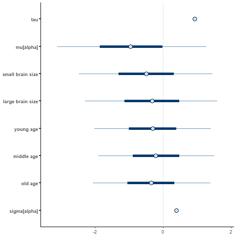
```


```{r,fig.cap='Posterior predictive checks of the bayesian estimation. Points correspond to Boussard data-set. Light and dark coloured bands correspond to the 50 and 90\\% credible interval predicted by the model'}
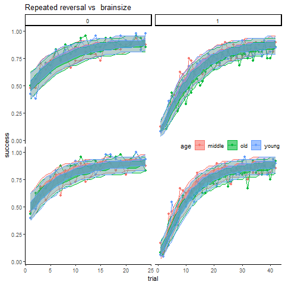
```

## References